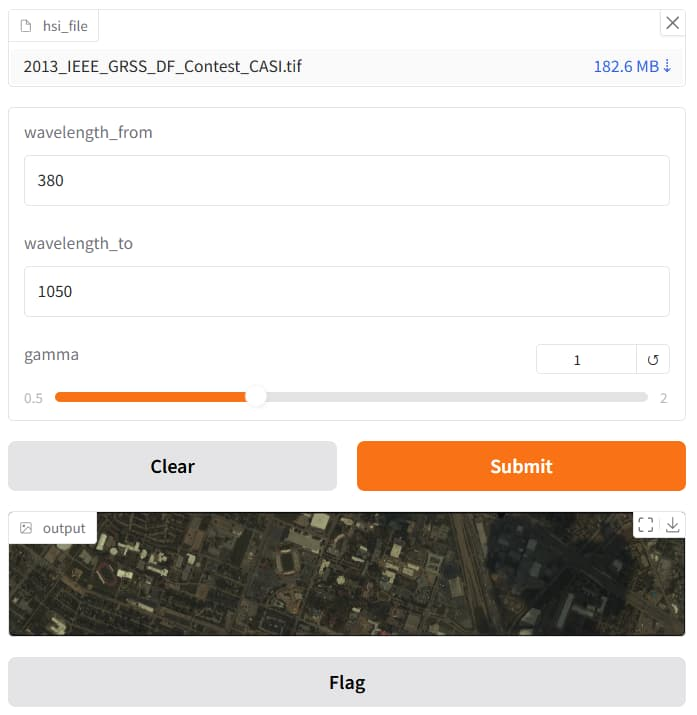

# hsi2rgb


Easily convert a hyperspectral image to an RGB image.

# Usage
1. Run the container: `docker run -it -p 7860:7860 songyz2019/hsi2rgb`
2. Open `http://localhost:7860` in your browser
3. Upload your HSI image (`.mat` or `.tif`)
4. Set the wave length range
5. Submit and see the result

# Screenshot


# Build
1. Build the container: `docker compose build`
2. Run the container: `docker compose up -d`

# License

```text
This program is free software: you can redistribute it and/or modify it under the terms of the GNU Affero General Public License as published by the Free Software Foundation, version 3.

This program is distributed in the hope that it will be useful, but WITHOUT ANY WARRANTY; without even the implied warranty of MERCHANTABILITY or FITNESS FOR A PARTICULAR PURPOSE. See the GNU Affero General Public License for more details.

You should have received a copy of the GNU Affero General Public License along with this program. If not, see <https://www.gnu.org/licenses/>.
```
