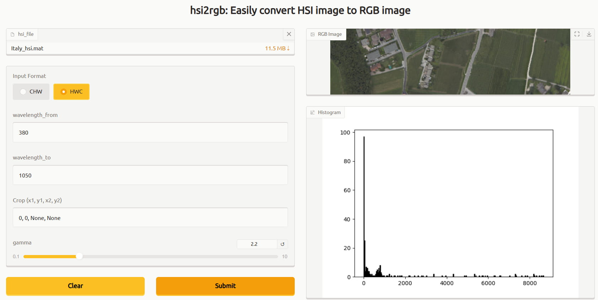

# hsi2rgb

Easily convert a hyperspectral image to an RGB image.

# Usage
1. Run the container: `docker run -it -p 7860:7860 songyz2019/hsi2rgb`
2. Open `http://localhost:7860` in your browser
3. Upload your HSI image (`.mat` or `.tif`)
4. Set the wave length range
5. Submit and see the result

# Screenshot

# Build
1. Build the container: `docker compose build`
2. Run the container: `docker compose up -d`

# License
AGPL-3.0-only
